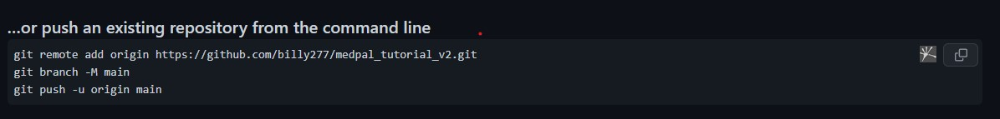

# 1.1 Project Setup

Here we will setup a new project with `GIT` version control
We will also setup our python environment and make sure it stays consistent by using a virtual environment tool called `pyenv`

## Check that you have the tools

1. Open a terminal and type in the commands you see below. (note that commands are lines with `$` in the code excerpts below. `>` indicates the output from the terminal).

2. Check git is installed by typing

```
$ git --version
> git version x.xx.x
```

** IF YOU DONT SEE A GIT VERSION STOP HERE AND GO TO THE `INSTALL GIT` SECTION BELOW BEFORE CONTINUING!!**

3. Check pyenv is installed by typing

```
$ pyenv --version
> pyenv x.x.x
Usage: pyenv <command> [<args>]
...
...
```

4. Install the `virtualenv` python package using the following command

```
$ pip install virtualenv
```

** IF YOU DONT SEE A PYENV VERSION, STOP HERE! AND GO TO THE `INSTALL PYENV` SECTION BELOW BEFORE CONTINUING!!**

## Project Steps A - Setup

1. Clone the repo we are working from to use as reference.

   ```
   $ git clone <url of repo>
   ```

2. Create a new folder (different from the one you cloned above and **NOT INSIDE IT**) on your computer and inside it make a subfolder called `part1`
3. Open the `part1` folder in terminal
4. initialize a new git project using the following command
   `git init`
5. lets first install the python version we will use `3.7.0`

   ```
   $ pyenv install 3.7.0
   > Installed Python-3.7.0 to /home/billy/.pyenv/versions/3.7.0
   ```

6. Now we want to use the python version we downloaded in our project folder so we use the `local` command to add a file that has our version number

   ```
   $ pyenv local 3.7.0
   ```

   This creates a new file called `.python-version` which keeps track of the python version we are using. If you open the file you will see the `3.7.0` number we specified.

7. Now we create a virtual python environment, this means for this folder/project, we will always have the same python version setup the same way. This avoids headaches later

   ```
   # To create the virtual environment we use the virtualenv package
   $ virtualenv venv
   ```

   Note that this created a new folder in your project called `venv`. This folder contains the virtual environment related information and the name of the virtual environment we created is called `venv`.

8. Now we start the virtual environment using the `source` command and using the executible in the newly created folder from step 4 above. This executible is located here: `./venv/bin/activate`. The command we use looks like this:

   ```
   $ source venv/bin/activate
   ```

Notice that your command line should now have a `(venv)` at the front. This means you are running the `venv` virtual environment we created.

## Project Steps B - Run a python application

1. Write a new .py file that prints Hello World to the console.
2. Test by running the file from the terminal using the following command

```
$ python <nameOfFile.py>
> Hello World!
```

## Project Steps C - Questions to test understanding:

Write the answers to these the best you can in a text file and add it to the project folder

1. What is git? Why do we use it?
2. What is pyenv? Why do we use it?
3. What version git, pyenv, and python are we using for our application?

## Project Steps D - Commit and submission

1. Make sure the new files are saved
2. Add the changes you made to git
   ```
   $ git add .
   ```
3. Commit the changes with the `initial commit` message
   ```
   $ git commit -m "initial commit"
   ```
4. Make a new repo (**DON'T** ADD README FROM THE GITHUB PAGE) in github and follow the steps to import existing repo - see screenshot below (**NOTE THAT THE URL IN THE SCREENCHOT IS NOT THE SAME AS YOUR NEW REPO -- THIS IS ONLY AN EXAMPLE!!!**):



---

## Appendix

### Installing GIT

#### MacOS

1. check if homebrew is installed
2. if brew is installed you will get some output -- as long as you dont have an error saying `brew not found`

```
$ brew install git
```

### Installing pyenv

- [link](https://github.com/pyenv/pyenv#installation)
- 
